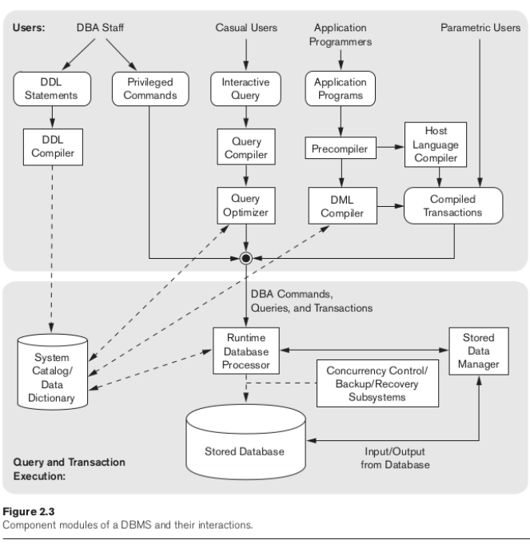

# Arquitetura de Banco de Dados

## Modelos

Abstração é essencial.

Primeiro pensamos no todo, depois nos detalhes.

* Modelos de Dados Conceitual - Visão de alto nível
  * Entidade
  * Atributos
  * Relacionamento
* Modelos de Dados Físico - Especialista
  * Índices
  * Hashes
* Modelo de Dados de implementação - Representacional
  * Modelo de dados relacional
  * Modelos hierárquicos
* Modelo de Dados Auto-descritivos
  * Descrição + Dados

## Esquema, Instâncias e Estados de um BD

O esquema é uma descrição concisa do banco de dados, representado por um diagrama.

As entidades dentro do esquema são denominadas de ''construct''.

Não determinamos os tipos de dados e itens no esquema.

Cada vez que efetuamos um Insert, Delete ou Update, há uma mudança de estado no banco de dados.

### Metadados

* Descrição do esquema
* Constructs
* Constraints

## Three-Schema Architecture

* Isolamento data/program
* Catálogo
* Views

A arquitetura é dividida nos seguintes esquemas:

* Internal Schema (física) - modelo físico de dados (como os dados do banco de dados serão persistidos)
* Conceptual Schema (física/lógica) - modelo de implementação (entidades, operações de usuário, constraints, relacionamentos)
* External Schema (lógica) - modelo conceitual(descrição do grupo, views)

## Linguagens para SGBD

DDL - Data Definition Language (esquemas)

Separação explícita:

* SDL - Storage Definition Language
* VDL - View Definition Language

DML - Data Manipulation Language (inserção, recuperação, etc.)

* Alto nível - não procedural
* Baixo nível - procedural

## Interfaces de SGBDs

* Web Clients
  * Baseado em lista (requisições e estrutura)
* App Mobile
  * Acesso a dados (ex.: bancos, reservas de hotel, etc.)
* Forms
* GUI
* NLI
* Pesquisa Keyword
* Speech input/output
* Interfaces
  * Naive
  * DBA

## Ambientes e Utilities de SGBD

O SGBD é um software modularizado.

 ### Utilities - Gerenciamento

* Monitoramento
* Reorganização do storage
* Backup
* Loading

## Arquitetura Modelo Cliente-Servidor

* Arquitetura Física Centralizada: quando fica centralizada a um único equipamento. 
* Arquitetura Distribuída: quando descentralizamos os conteúdos, como tendo um servidor para persistir o banco de dados, outro equipamento tendo o SGBD, etc.

## Classificação de SGBDs

* Modelo de dados (SQL ou NoSQL)
* Número de usuários
* Número de sites
* Custo
* Tipo de caminho de acesso
* Performance

## Referências principais

- Referência bibliográfica: Fundamentals of Database Systems – Navathe, 7° edição editora: Pearson 
- Projeto de banco de dados: Uma visão prática - Edição revisada e ampliada - Machado 17° edição, editora: Saraiva
- https://www.ime.usp.br/~andrers/aulas/bd2005-1/aula3
- https://www.devmedia.com.br/a-historia-dos-banco-de-dados/1678
- https://db-engines.com/en/ranking
- https://www.opservices.com.br/banco-de-dados/
- https://www.quora.com/What-is-a-canned-transaction
- [https://www.geeksforgeeks.org/impedance-mismatch-in-dbms/#:~:text=Impedance%20mismatch%20is%20the%20term,Attributes%20and%20their%20data%20types](https://www.geeksforgeeks.org/impedance-mismatch-in-dbms/#:~:text=Impedance mismatch is the term,Attributes and their data types)
- https://www.oreilly.com/library/view/mysql-reference-manual/0596002653/ch03s05.html
- [https://docs.oracle.com/pt-br/solutions/deploy-lustre-fs/index.html#:~:text=Lustre%20%C3%A9%20um%20sistema%20de,do%20Linux%20e%20do%20cluster](https://docs.oracle.com/pt-br/solutions/deploy-lustre-fs/index.html#:~:text=Lustre é um sistema de,do Linux e do cluster).
- https://docs.oracle.com/pt-br/solutions/deploy-lustre-fs/index.html#:~:text=Lustre%20%C3%A9%20um%20sistema%20de,do%20Linux%20e%20do%20cluster.
  https://stackoverflow.com/questions/1075074/opinions-on-netcdf-vs-hdf5-for-storing-scientific-data#:~:text=NetCDF%2C%20starting%20with%20version%204.0,a%20much%20wider%20tool%20base
- https://www.quora.com/What-are-all-the-DBMS-that-are-being-used-by-Google-Facebook-and-Twitter-1
- https://introbigdata.org/
- https://www.mongodb.com/big-data-explained/examples
- https://intellipaat.com/blog/10-big-data-examples-application-of-big-data-in-real-life/
- https://instagram-engineering.com/instagration-pt-2-scaling-our-infrastructure-to-multiple-data-centers-5745cbad7834
- https://blog.twitter.com/engineering/en_us/topics/infrastructure/2017/the-infrastructure-behind-twitter-scale#:~:text=Twitter%20was%20built%20on%20MySQL,eventually%20many%20large%20database%20clusters.
- https://www.mysql.com/customers/view/?id=757
- https://engineering.linkedin.com/espresso/introducing-espresso-linkedins-hot-new-distributed-document-store#:~:text=To%20meet%20the%20needs%20of,both%20serving%20different%20use%20cases

