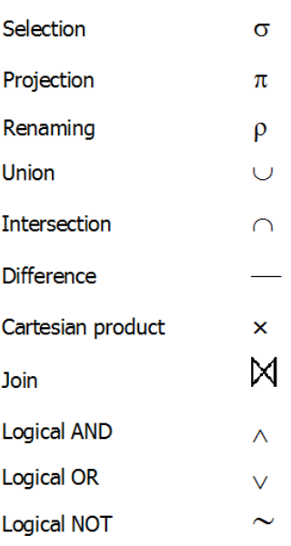
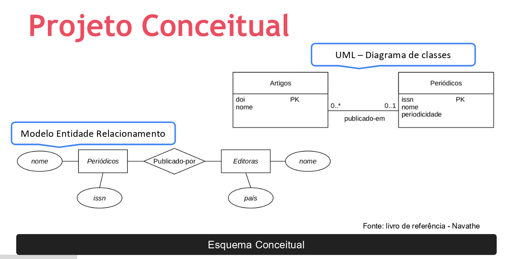
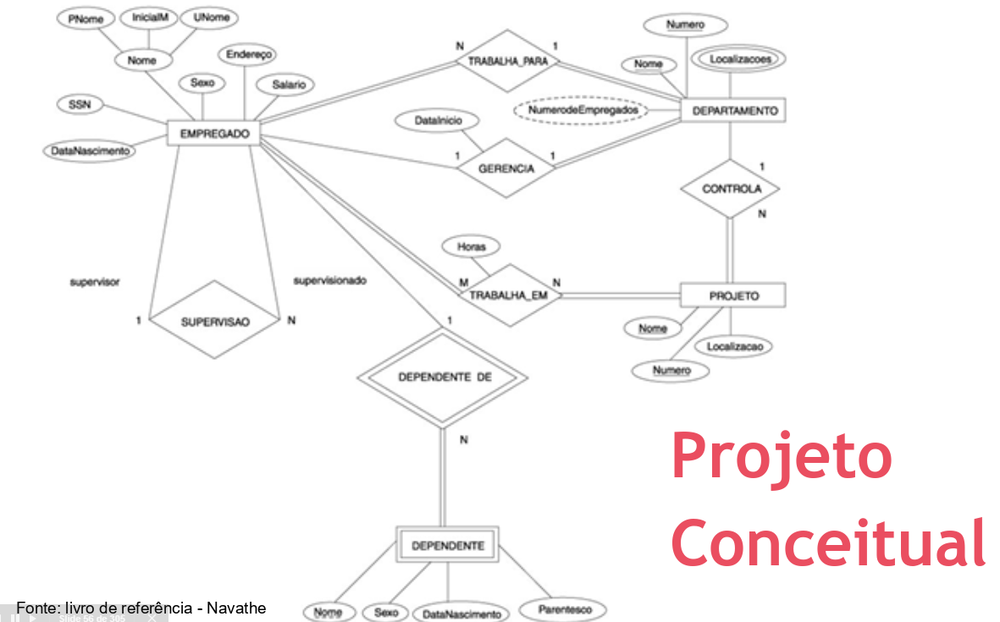

# Fundamentos de Modelagem e Projeto de Banco de Dados

## Características de um Banco de Dados

Relembrando:

* Gerência de dados (tiramos o papel da aplicação na gerência dos dados, e entregamos esse papel para o banco de dados em si)
* Isolamento data/program (isolamos para evitar toda uma reprogramação da aplicação, numa necessidade de alteração de alguma característica no banco de dados)
* Integridade e Consistência
* Segurança
* Views
* Recuperação
* Recovery
* Concorrência

## Mundo Fechado e mini-mundo

Mundo Fechado: Lógica formal do sistema que vai além de BD. (Close World Assumption) 

Se está dentro do contexto do BD = verdadeiro. 

Se não está dentro do contexto do BD = falso.

CWA > Lógica de Predicados e Preposição

Mini-mundo: um "pequeno pedaço do mundo".

## Álgebra Relacional

O predicado é a parte da oração que possui o verbo e que traz informações sobre o sujeito.

Critérios: Having, Where...

Linguagem formal para consulta/extração de dados.

SQL!

Conjunto de operações:

* Operações de conjuntos
* Operações de BD relacional (exclusivos de SGBDs relacionais)

Alguns tipos de operações:

* ANY
* MAX
* AVG
* COUNT
* SUM
* MIN

## Álgebra Relacional e Projeto de Banco de Dados

Álgebra Relacional > criam operações > SGBD compila essas informações > SGBD retorna o resultado da ação (através de tabela, view, join, etc.)

Teoria de conjuntos (Ex.: Joins do SQL!).

Temos de levar em consideração o fator performance. Disponibilidade x Tempo de gravação.

### Processo

* Projeto conceitual
* Projeto lógico
* Projeto físico
* Validação
* Produção
* Manutenção

## Falando sobre Modelagem

BD particular > Softwares (GUI para users) > Queries e updates

Muitas vezes o desenvolvimento do BD pode caminhar junto com o desenvolvimento da aplicação.

Planejar (Identificar seus problemas) > Fazer (Testar possíveis soluções) > Checar (Estudar resultados) > Agir (Implementar a melhor solução)

Temos que entender as necessidades do cliente. Cliente nem sempre é o cliente (no conceito de compra e venda em si). Cliente é nesse caso o requerente daquele projeto. 

## Projeto: Como "nasce" um Banco de Dados?

* Entender o contexto e requisitos (qual o cenário que queremos representar? quais as necessidades do cliente?)
* Perfil
* Implementação
* Modelo
* Arquitetura
* Funcionalidades

O que eu quero representar?

Cenários:

* Colaboradores
* E-commerce
* Universidade
* Produção
* Banco (financeiro)
* Farmácia
* Bibliotecas

Como resolver?

Modelagem Conceitual > Lógica > Física

## Design de BDs - Projeto Conceitual

Como criar o modelo? Linguagens de modelagem de dados (Gráficas ou Textuais).

Primeiro passo: Requisitos, perguntas a serem respondidas, visões, etc.

* Coleta de dados
* Análise

## Projeto conceitual: Entendendo o passo a passo

Modelo Entidade Relacionamento: também chamado de DER.

Requisições funcionais da aplicação: foco do engenheiro de software.

Modelo de Alto Nível:

* Requisitos funcionais (O que executar? Quais processos?)
* Requisitos não funcionais (segurança, desempenho, etc.)

Como será armazenado? => isso será independente do modelo de banco de dados.

Coleta (dados e requisitos) > Análise (dados e requisitos) > Esquema conceitual (conceitos de alto nível)

## Exemplificando o Projeto Conceitual e Processo

* Projeto Conceitual (o que vai ter?)
* Projeto Lógico (como estruturar?)
* Projeto Físico (como implementar?)

## Implementação: Projeto Lógico e Físico

Descrição do modelo conceitual:

* Organização dos dados, com base na Estrutura (SGBD).

## Fases de desenvolvimento de BDs e Aplicações

## Aplicação: Modelagem de dados

