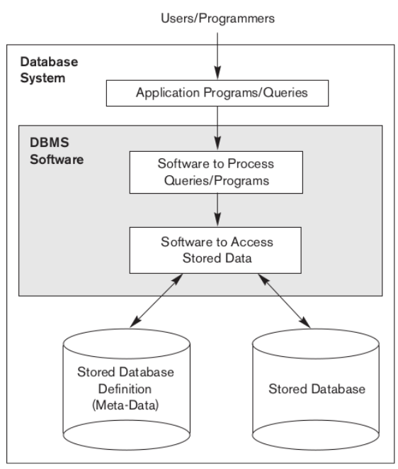
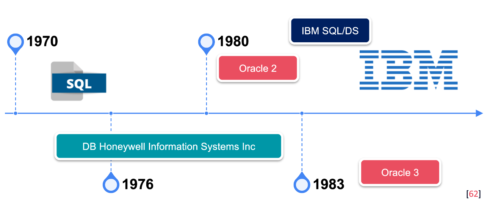
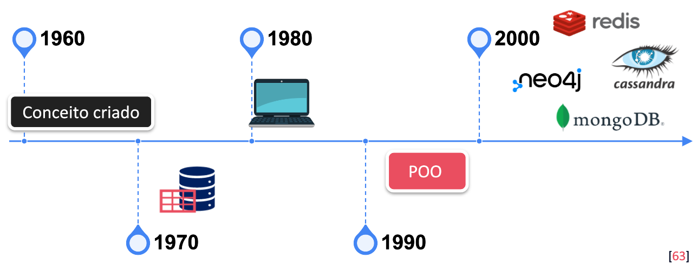
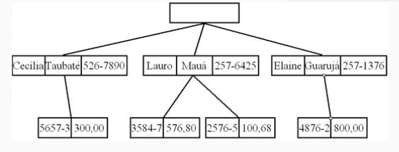
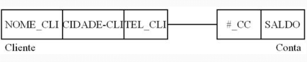
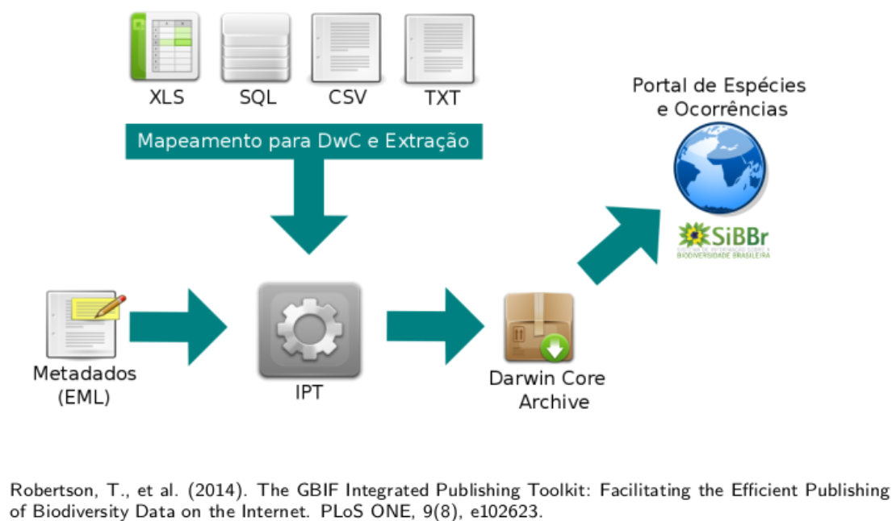

# Introdução a Banco de Dados

## Objetivo Geral

Apresentar a nós a modelagem de dados voltada para um sistema de banco de dados.

 ## Cenário de dados

TUDO são dados.

Os dados precisam estar persistidos e confiáveis.

Persistidos = armazenados em algum lugar.

O papel do cientista de dados é transformar toda essa gama de dados em algo útil para a organização.

3 V's = Velocidade, Variedade e Volume

## O que são bancos de dados?

Banco de dados NÃO é SGBD! São coisas distintas.

Dados são fatos, algo que pode representar, descrever alguma coisa.

Banco de dados é um conjunto desses dados, uma estrutura que irá armazenar estes dados, seus relacionamentos, etc.

Um SGBD por exemplo pode conter vários bancos de dados diferentes.

Uso mais restrito:

* Contexto - representação do mundo real;
* Coerência;
* Propósito.

Geralmente o acesso ao banco de dados é feito via API.

Quando acessamos os dados de alguma forma, estamos executando alguma ação.

Quando executamos alguma ação, há uma mudança de estado.

Para que o sistema seja confiável, precisamos que estas ações façam com que ocorram mudanças de um estado válido para outro válido, para que possamos retroceder nas ações sem problemas, voltar ao estado anterior a estas mudanças de estados.

Tamanho? Vários. Pra tudo que é jeito, pra tudo que é gosto.

Porque tudo isso de dados hoje em dia? Há uma multitude de utilidade para os dados armazenados em grandes bases. Como por exemplo redes sociais, há toda uma gama de dados diferentes e comportamentos diferentes com estes dados, como postagens dos usuários com fotos, arquivos, amigos, grupos, etc.

Na Amazon por exemplo, 60 milhões de usuários, 42TB, SGBD distribuído.

## SGBDs - Sistemas de Gerenciamento de Banco de Dados

### Definição

Quando pensamos em SGBD (DBMS - Database Management System em inglês), pensamos em um software de propósito geral.

Precisamos definir quais tipos de dados serão persistidos, a estrutura e as constraints.

Constraints = regras

### Construção

Pensamos na construção em si da base de dados, a inserção dos dados.

### Manipulação

Pensamos na parte da manipulação de dados em si, seja por exemplo para recuperação desses dados, seja para emissão de relatórios.

### Compartilhamento

Quem pode acessar e como podem acessar?

Gerenciamento dos acessos e da simultaneidade neste acesso.

Além desses pontos, temos que pensar na Proteção e no Ciclo de vida de longo prazo da base de dados.

O SGBD é um software modular.

Exemplo de uma estrutura em um projeto de software.

### Metadados

Informações que fornecem uma descrição concisa dos dados na base.

As bases de dados são persistidos em arquivos. Mas precisamos pensar em como iremos estruturar esses dados, como serão manipulados, qual tipo de estrutura irá atender melhor as necessidades dessas manipulações dos dados.

Quando é realizado um update no banco por exemplo, por padrão o banco de dados realiza o bloqueio e a liberação das tabelas.

## Breve história dos SGBDs

A ideia de gerenciamento de banco de dados surgiu em meados de 1960. O conceito de dados relacionais em meados de 1970. Com intuito de diminuir custo com pessoal.

Na época, tínhamos Modelos baseados em sistemas de arquivos, como modelo em rede, modelo hierárquico e modelo relacional.

Modelo relacional foi criado por Ted Codd.

IBM criou o Sistema R, com base em DB2.

### Cronologia

### Modelo Hierárquico

IMS - Information Management System

* Buscas de Registros: temos os dados e os links, quais dados se "amarram" uns nos outros
* TAD tree - com raíz

Utilizado no BDDBase, Cobol, Clipper, Fox Pro, entre outros.

Exemplo de modelo hierárquico:

### Modelo em rede

* Links - Ponteiros entre nós.
* Surgiu em 1964.
* Relacionamento N:M

Exemplo de modelo em rede:

Por que da criação do modelo relacional? Os modelos acima não são aplicáveis em todos os casos e são mais complexos. 

O modelo relacional trouxe aplicabilidade mais vasta e transparência do sistema. 

## Modelo de Banco de Dados Relacional

* Álgebra relacional
* Relações
* TAD para armazenamento
* Transparência

Surgiu em meados de 1970.

Temos dois tipos de usuários: o usuário convencional e o DBA.

O DBA irá definir as tabelas, estruturas, constraints do banco de dados e os comandos traduzidos pelo processador LDD - Linguagem de Definição de Dados.

Temos também o Designer de Banco de Dados, que irá auxiliar o DBA na modelagem de alto nível (definição de entidades, constraints, etc.) do banco de dados.

Como o BD entende o LDD?

A query precisa ser compilada, é encaminhada a um mecanismo de execução das queries, depois para um gerenciador e daí então retornar as informações (metadados e schemas).

Características:

* Altera e extrai informações;
* Duráveis (as modificações são duráveis);
* Transações são agrupadas para execução.

### Storage e Buffer

* Gerenciador de armazenamento;
* Gerenciador de buffer.

É apenas um SGBD em operação? Nope!

Pode haver mais de um SGBD na mesma empresa e, para isso, necessitamos de integração entre esses SGBDs.

### Abordagens para Integração de SGBDs

* Repositórios centralizados;
* Mediadores (Middleware).

Exemplo de integração:

## SGBDs mais utilizados no mercado

* [Oracle](https://oracle.com/)

Arquitetura já voltada para grandes corporações, projetado para maior performance. Uma reserva muito grande no mercado corporativo. Alta escalabilidade e confiabilidade.

* [MySQL](mysql.com)

Também mantido pela Oracle, porém é solução voltada para código aberto. Bem leve e mais utilizado para soluções web. Tem boa integração com PHP.

* [Microsoft SQL Server](https://microsoft.com/sql-server)

Plataforma mais abrangente, tendo ferramentas voltadas para integração com BI.

* [PostgreSQL](postgresql.org)

Primeira escolha para desenvolvedores que utilizam algumas linguagens, como Python.

* [mongoDB](mongodb.com)

SGBD NoSQL. Armazena dados em blocos. Voltado para armazenamento de documentos.

* [Redis](redis.io)

SGBD No SQL. Orientado a chave-valor. Performático, escalável. Pensado para  acesso a dados com rapidez.

* [ElasticSearch](elastic.co)

Armazena os dados de forma centralizada. Interface simples, estrutura via HTTP. Utiliza JSON.

* Access

Mais simples, acessível, tem integração com o pacote Office.

* [MariaDB](mariadb.org)

Projeto derivado do MySQL. Método de consulta mais otimizado que o MySQL.

* [Cassandra](https://cassandra.apache.org/)

Banco NoSQL, open source, baseado em colunas. Para gerenciamento de larga escala. Inicialmente desenvolvido pelo Facebook.

Ranking: https://db-engines.com/en/ranking

Características dos mais utilizados no mercado

* Popularidade
* Tempo de mercado
* Documentação
* Robustez
* Confiabilidade
* Segurança
* Multiplataforma

## A era dos dados e o futuro da modelagem

Papel central - sistemas corporativos

Requisições comuns:

* MIN/MAX
* COUNT
* MÉDIA
* SOMA

### Pesquisa

* Número de tarefas computacionais;
* Quantidade de dados;
* Heterogeneidade;
* Computação paralela e distribuída.

Exemplos:

* Pesquisa de clima;
* Mapeamento de galáxias, supernovas e padrões (6.6TB/dia, mais e 400 cientistas, 25 instituições)

### 4º Paradigma

* Instrumentos e simulações que geram grande volume de dados
* Novo modelo: base na análise e exploração de dados (e-Ciência)

Paradigmas ao longo do tempo:

* Ciência empírica (até meados de 1600);
* Ciência teórica (até meados de 1950);
* Ciência computacional (até meados dos anos 2000);
* Ciência orientada a dados ((Big) Data-driven Science) - (de 2000 em diante).

#### Requisitos

* Composição
* Execução
* Análise
* Reutilização
* Reprodutividade
* Abstração
* Escalabilidade

#### Experimentos realizados em larga escala

* Paralelismo

Múltiplos processadores operando concorrentemente.

* Big Data

Processamento paralelo de dados persistentes e particionados.

* Cloud

Recursos de terceiros - soluções de tecnologia como serviço (AWS, Azure, etc).

#### HPC - High Performance Computing

* Nós de processamento;
* Sistema de arquivos paralelos - sem persistência;
* Modelos: MPI, OpenMP, OpenCL;
* Acesso: HFF5 e NetCDF.

#### Big Data

* Process e Storage: nós de processamento;
* Sistema de arquivos paralelos - persistente;
* Modelos: MapReduce, Spark, SGBDs paralelos.

Em resumo a diferença entre os dois é que o HPC não persiste os dados, enquanto o Big Data persiste.

## Novo cenário e novas tecnologias

* Carreira tech em Data;
* Data-driven;
* Novos modelos de SGBDs (exemplo: noSQL).

### Engenheiro de dados

* Desenho/construção
* Sustentação das soluções de dados

O engenheiro de dados extrai os dados de fontes heterogêneas e disponibiliza os dados aos consumidores dos mesmos, analistas e cientistas.

### Cientista de dados

* Modelagem
* Reconhecimento de padrões / predição

Busca responder perguntas atreladas ao contexto do negócio. Buscando insights através de técnicas de modelagens.

### Analista de dados

* Criação de dashboards
* Apresentação visual dos dados

Busca entender o comportamento do negócio a partir dos dados. Faz o diagnóstico, identifica os motivos dos comportamentos e analista métricas.

### Data-driven

Setores estratégicos da empresa, como de gerenciamento e marketing, utilizam essa abordagem do Data-driven. Focado no cliente.

Análise e Interpretação.

Analise > Entenda > Decida

### Modelos NoSQL

Ao longo do tempo, conforme as coisas evoluiram, o modelo relacional deixou de preencher algumas lacunas, deixou de atender de forma satisfatória alguns cenários. E esses cenários que o NoSQL procura atender.

NoSQL = Not only SQL

#### Orientado a Documentos (exemplo: mongoDB)

* Baixa curva de aprendizado
* Baseado em JSON
* Escalabilidade horizontal
* Multiplataforma
* Transações ACID para multidocumento
* Consultas suportam JavaScript

#### Wide-columns (Orientado a Colunas - exemplo: Cassandra)

* Origem: Facebook
* Open-source em 2018
* Performático
* Descentralizado
* Consultas: CQL

#### Key-Value (exemplo - Redis)

* 2009 - estrito em C
* Compatível com outras linguagens
* Performático
* Suporte a: strings, lists, maps, sets, JSON, graphs, entre outros.

#### Grafos (exemplo - Neo4J)

* 2007 - escrito em Java
* TAD: grafos
* Cypher: query para grafos
* Data science
* Compatível com Python, NodeJS, GO, .NET e Java

#### Orientado a Objetos (db4objects)

* 2008 - open-source
* Escrito em .NET e Java
* Cross-platform

#### Outros exemplos de DB e Cloud

* Bancos de dados como serviço, como Amazon RDS, DynamoDB, Azure BD, Amazon Redshift, Amazon Aurora, entre outros

O que vemos também nas empresas é juntar o modelo relacional com outros modelos. Não apenas um único modelo de dados.
