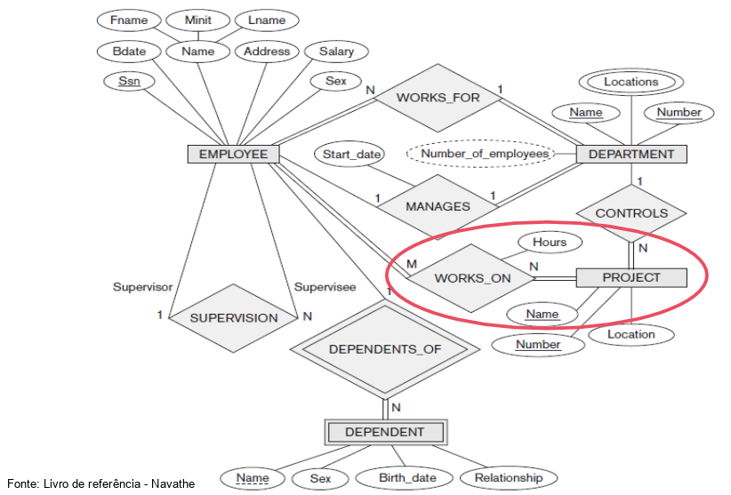

# Modelo de Entidade Relacionamento com Banco de Dados

## Modelo ER: Tipos de Entidades, Chaves e Atributos

Modelo Conceitual: Entidades, Relacionamentos e Atributos.

Como representamos isso? Com o DER.

### Diagrama ER

* Raras modificações
* Facilidade de manipular
* Esquema ER do banco de dados

#### Entidades

* Componente básico
* Existência independente
* Possuem atributos relacionados

A ideia de Entidade vem de Objetos (POO).

#### Atributos

* Características/descriçao das entidades
* Atributos relacionados as instâncias

Tipos de Atributos:

* Atômicos x Compostos (atributos de valores simples x concatenação de vários desses atributos simples)
* Atributos multivalorados
* Armazenados e derivados
* Atributos Nulos
* Atributos Complexos

Podemos também categorizar em atributos armazenados e atributos derivados.

Elementos DER

* Entidades
* Atributos
* Chaves

## O que é a Entidade Fraca no modelo ER?

* Chave não obrigatória
* Dependência
* Exclusão cascata

## Exemplo de modelo conceitual - Company

Inicialmente começamos com um esboço das entidades e relacionamentos. Refinamos então aos poucos os atributos, as entidades em si, pois pode ocorrer de algum atributo simples ser na verdade um composto, ou um atributo fazer mais sentido se tornar uma entidade, e assim por diante.

Exemplos interessantes:

* Projetos x funcionários
* Número de horas por projeto

Para estas duas questões, tratamos com relacionamentos.

## Relacionamentos, Papéis e Constraints estruturais

Exemplos: 1 para 1, 1 para muitos, etc.

Classificados por:

* Grau (Ex.: Binário - quando retornamos informações relacionadas de duas entidades; Ternário - quando retornamos informações relacionadas de três entidades)
* Auto-relacional ou não
* Cardinalidade

Atribuimos também o Papel da entidade. Qual o significado daquela entidade.

Temos também o Auto-relacionamento, quando há vários relacionamentos entre duas entidades e entre mesmos atributos.

## Constraints de Relacionamentos Binários

### Cardinalidade

Número máximo de instâncias que participam de algum relacionamento.

Ex: 1:1 ; 1:N; etc.
### Participação

* Relação de dependência
* Minimum Cardinality Constraint
* Classificação: total e parcial

### Atributos de relacionamento

Há atributos relacionados a mais de uma entidade.

## Tipos de Entidades Fracas

Entidades Fracas: Dependem de outra entidade

Entidades Fortes: Owner Entity Type

Representamos Entidades Fracas com um retângulo de linha dupla no DER.

### Notações

* Entidades: classes/objetos (retângulo)
* Relacionamentos: agregações (losango)
* Atributos: propriedades elementares (elipse conectado com linha)
* Entidades Fracas/Relacionamentos Fracos: figura com linha dupla
* Chave parcial: linha pontilhada dentro da elipse
* Chave principal: linha contínua dentro da elipse
* Dependência de existência: elipse de linha dupla

### Outras notações

* Atributo derivado
* Atributo composto
* Participação total
* Cardinalidade
* Constraint estrutural

### Construtores do Esquema

Convenção - nomeando

* Entidade e Relacionamento
* Atributo
* Função

Devemos nomear de forma que possamos dar significado a estes itens. Não utilizar algo simples demais, como x,y ou z.

## Refinando o Design ER para Company

Relacionamentos: 

- Empregado x Departamento: **Gerência**
- Empregado x Departamento: **Trabalha para**
- Departamento x Projeto: **Controla**
- Empregado x Empregado: **Supervisiona**
- Empregado x Projeto: **Trabalha** **em**
- Empregado x Dependente: **Dependentes** **de**

## Alternativas - UML

* Linguagem para desenvolvimento de software
* Trabalha com visões: interpretada e construída
* Orientação a objeto
* Liberdade para o desenvolvedor
* Compreensão facilitada

Principais diagramas:

* Caso de uso
* Classe
* Interação

São classificados em Diagrama estrutural e Diagrama de comportamento.

### Diagrama de Classes

* Classe = entidade
* Atributos
* Operações
* Associações
* Atributo de Link
* Associação binária
* Associação reflexiva
* Multiplicidade

Relacionamentos:

* Associação
* Agregação

Entidades Fracas:

* Qualified Association
* Discriminator

## Relacionamentos de Alto Grau

* Ternário, N-ário
* Perspectiva diferente do binário
* Instâncias refletem a visão

## Exemplificação de Relacionamentos N-ário - Consulta médica

## Exemplificação de Relacionamentos N-ários - Curso e Entrevista

